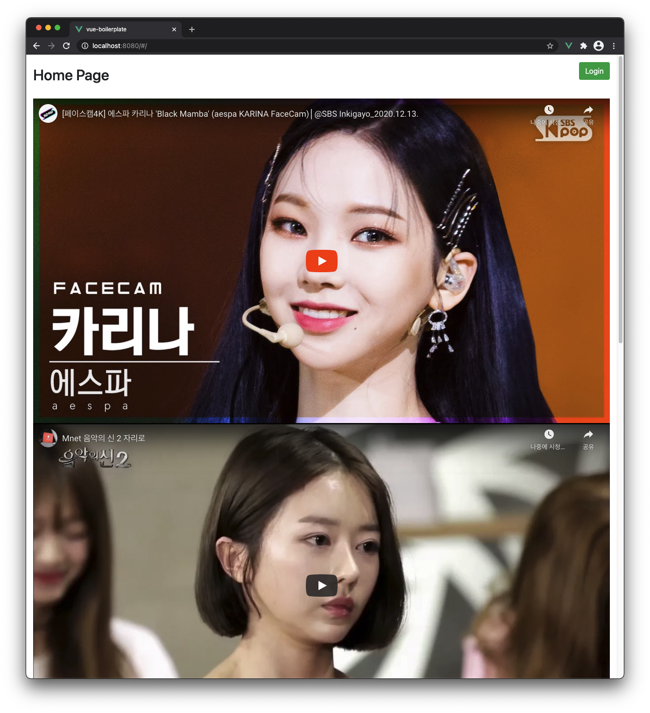
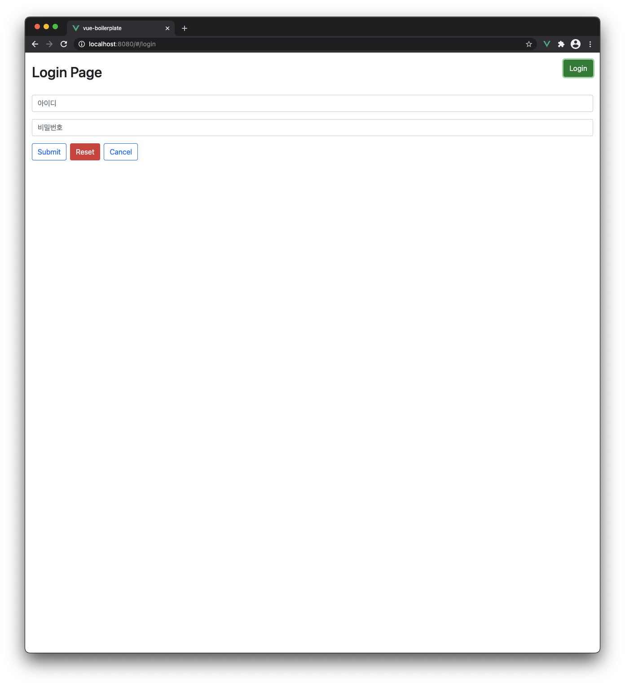
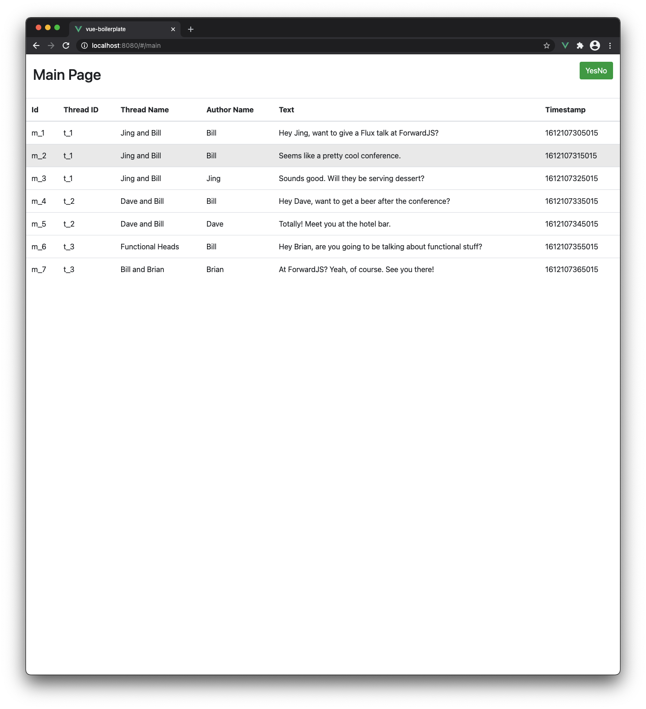
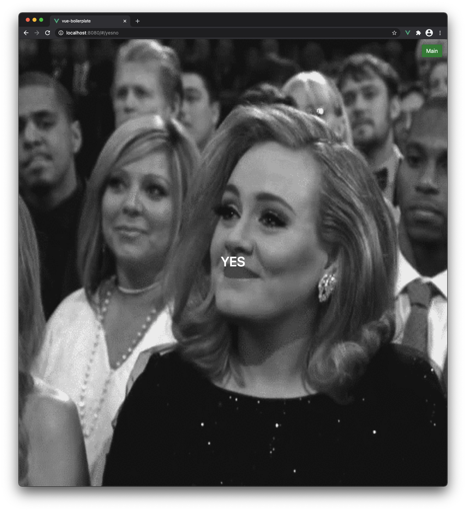

# vue boilerplate

vue.js 보일러플레이트 프로젝트를 만들어 보았습니다. 

- vue, vuex 를 이용한 기본 보일러플레이트 소스
- store 를 모듈로 돌아가게 하였습니다
- 액션에서 모든 로직을 처리합니다
- 액션에서 프로미스를 리턴하게 하여 뷰에서 필요한 처리는 뷰에서 처리하도록 합니다
- api 코드는 오로지 들어오는 값대로 처리하고 값만 뱉어주도록 작성

### 남아있는 과제

남아있는 과제를 여러분께 돌립니다. 현재 로그인 정보를 단순 store 에 저장해 두었습니다. 휘발성이기 때문에 새로고침 시 로그아웃이 되어버리네요. 쿠키나 로컬스토리지로 바꿔서 사용을 해야하겠습니다.

스피너 처리도 추가하고 싶네요. 추가해야 할 부분이 너무 많네요.  

### 스크린샷

